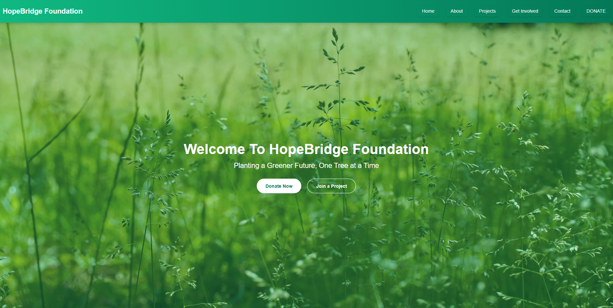
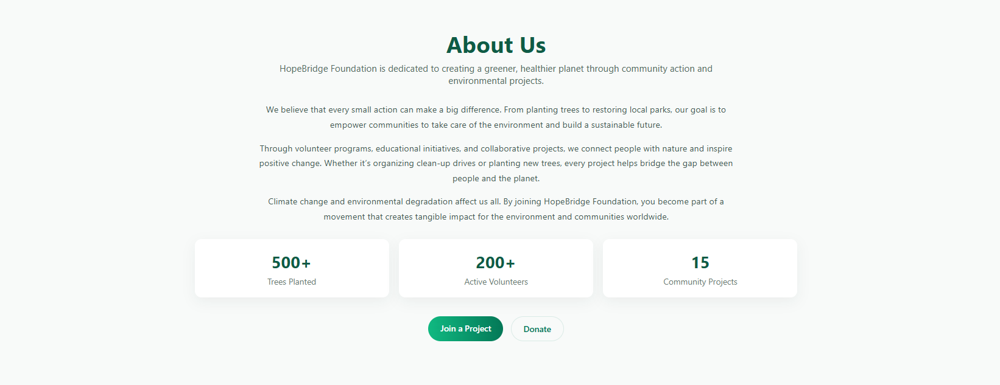
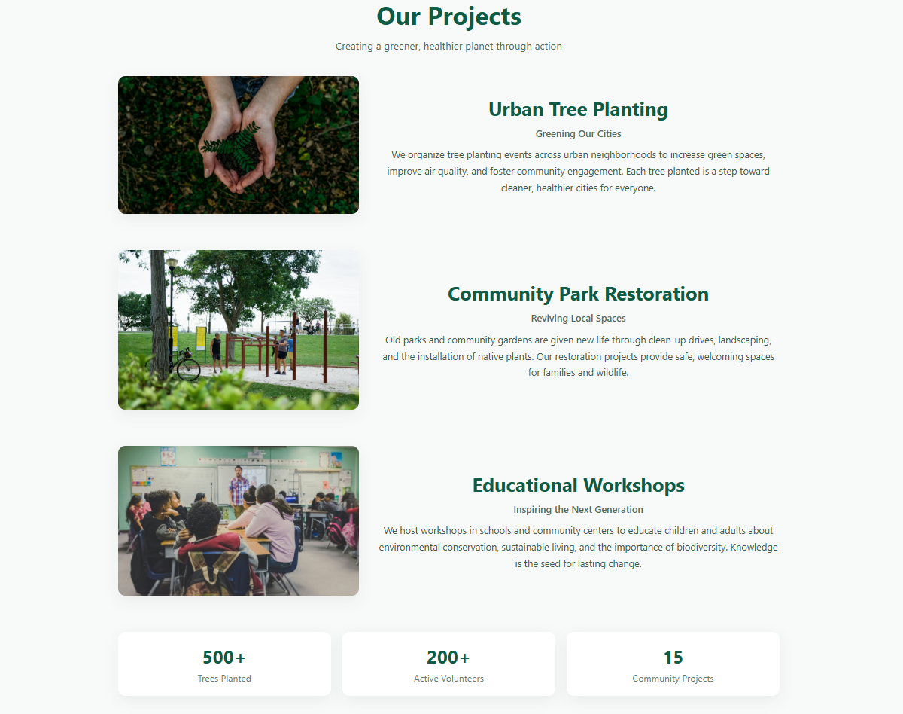
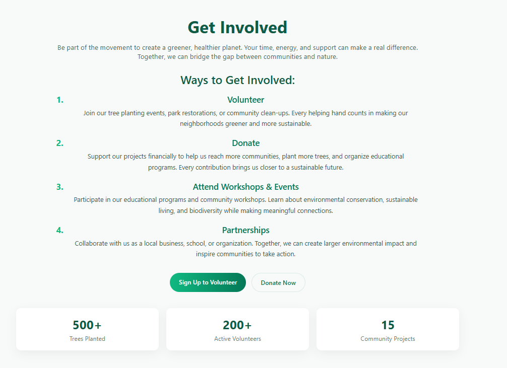
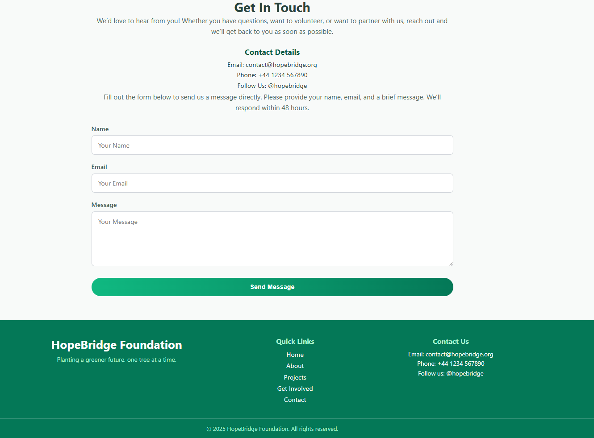

# HopeBridge Foundation Website

[](https://reactjs.org/)  
[](https://www.typescriptlang.org/)  
[](https://developer.mozilla.org/en-US/docs/Web/HTML)  
[](https://developer.mozilla.org/en-US/docs/Web/CSS)  

A fully responsive, modern charity website built with **React.js**, **TypeScript**, **HTML**, and **CSS**, designed to showcase environmental projects and volunteer opportunities.

---

## 🌟 Overview

HopeBridge Foundation is dedicated to creating a greener, healthier planet through community action.

This website demonstrates:

- A **clean and modern design** with a green-themed color scheme
- Fully **responsive layout** for mobile, tablet, and desktop
- Clear **call-to-action buttons** for donations and volunteering
- Smooth **scrolling navigation**
- **Reusable React components** for scalability

---

## 📌 Features

- Hero banner with CTA buttons
- About Us section with mission and impact
- Projects section with detailed cards and impact highlights
- Get Involved section with multiple ways to participate
- Contact form and contact details
- Footer with navigation and social links

---

## 🖼 Screenshots

> All screenshots are in the `/screenshots` folder.

**Home / Hero Section**  


**About Section**  


**Projects Section**  


**Get Involved Section**  


**Contact Section**  


---

## 🛠 Tech Stack

- **Frontend:** React.js + TypeScript
- **Markup & Styling:** HTML5, CSS3
- **Version Control:** Git & GitHub

---

## 🚀 Getting Started

1. Clone the repo:  
```bash
git clone https://github.com/YOUR_USERNAME/hopebridge-foundation.git
